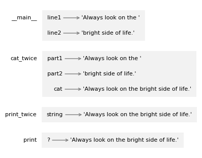

### Defining a new function
A function definition specifies the name of a new function and the sequence of statements that run when the function is called.

```
def print_lyrics():
    print("I'm a lumberjack, and I'm okay.")
    print("I sleep all night and I work all day.")
```

def is a keyword that indicates that this is a function definition. The name of the function is print_lyrics. Anything that is a legal variable name is also a legal function name.

The first line of the function definition is called the header - the rest is called the body. The header has to end with a colon and the body has to be intented (conventionally by four spaces).

Defining a function creates a function object, which we can display like this:
```
print_lyrics

<function __main__.print_lyrics()>
```
The output indicates that print_lyrics is a function that takes no arguments. __main__ is the name of the module that contains print_lyrics.

### Parameters
Some of the functions we have seen require arguments; for example, when you call abs you pass a number as an argument. 

```
def print_twice(string):
    print(string)
    print(string)
```

The variable name in the parentheses is called a parmeter. When the function is called, the value of the argument is assigned to the parameter. 


### Stack diaram
To keep track of which variables can be used where, it is sometimes useful to draw a stack diagram. Like state diagrams, they show the value of each variable, but they also show the function each variable belongs to.

Each function is represented by a frame. A frame is a box with the name of a function on the outside and the parameters and the local variables of the function on the inside.


The frames are arranged in a stack that indicates which function called which, and so on. 